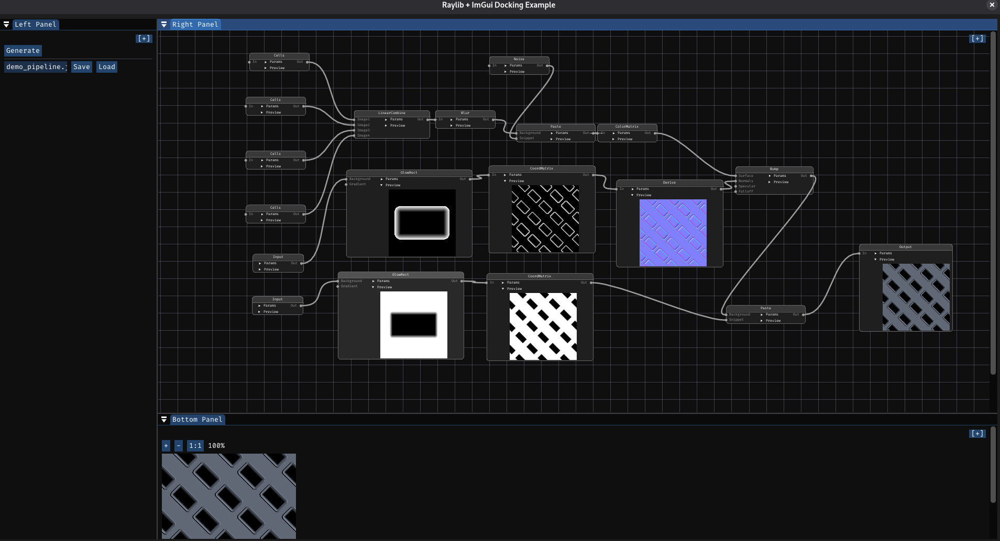

# TEXGEN

Node-based procedural texture generator for Linux. Connect generator and filter nodes in a visual graph to create tileable textures, noise patterns, and materials — all in real time.

Built with C++20, raylib, and Dear ImGui.

Texture generation core based on [gentexture](https://github.com/farbrausch/fr_public) by Fabian Giesen (public domain).

## Screenshot

<p align="center">
  
</p>

## Requirements

- Linux
- g++ (C++20)
- cmake
- ninja
- git

## Build and Run

```bash
./run.bash
```

Clones all dependencies, builds raylib, builds the project, and runs it.

```bash
./clean.bash        # remove everything (deps + build)
./clean.bash build  # remove build products only
```

## Keyboard Shortcuts

### Canvas

| Shortcut | Action |
|----------|--------|
| Right-click | Open context menu (create nodes) |
| Middle-drag | Pan canvas |
| Scroll wheel | Zoom in/out |
| Delete | Remove selected nodes |
| Ctrl+Z | Undo (up to 50 levels) |
| Ctrl+Y | Redo |
| Ctrl+C | Copy selected nodes (with connections) |
| Ctrl+V | Paste copied nodes |

### Sliders

| Shortcut | Action |
|----------|--------|
| Scroll wheel (hover) | Increment/decrement value |
| Arrow Up/Down (hover) | Increment/decrement value by one step |
| Ctrl+Click | Type an exact value (can exceed min/max range) |

## Interface

The interface is split into three panels:

- **Left Panel** — Generate button, project save/load (with file browser), Save As / Load buttons
- **Bottom Panel** — Output image preview with zoom controls (+, -, 1:1). Updates automatically when parameters change
- **Right Panel** — Node canvas with minimap (bottom-right corner)

### Minimap

The minimap in the bottom-right corner of the canvas shows an overview of all nodes. Blue rectangles are normal nodes, yellow are selected. The white outline shows the current viewport.

## Nodes

### Sources (no inputs)

| Node | Description |
|------|-------------|
| **Input** | Solid color fill (configurable size and RGBA) |
| **Image** | Load an image file (PNG, TGA, JPG, BMP) with file browser. Auto-resizes to power-of-2 |
| **Gradient** | 2-pixel gradient from Color1 to Color2. Used as color ramp for Noise/GlowRect |

### Generators (procedural patterns)

| Node | Description |
|------|-------------|
| **Noise** | Perlin noise with configurable frequency, octaves, fadeoff, and seed. Accepts optional Gradient input for color ramp. Mode controls: Signal (Direct/Abs), Scale (Unnorm/Normalize), Type (White/Bandlimit) |
| **Cells** | Voronoi cell pattern. Color mode: Gradient (colors from ramp) or Random (per-cell random from seed) |
| **Crystal** | Voronoi diagram with near/far coloring |
| **Bricks** | Brick/tile pattern with configurable size, fuge, and color variation |
| **Perlin Noise RG2** | Alternative Perlin noise with contrast and start octave controls |
| **Directional Gradient** | Spatial gradient between two points with configurable colors |
| **Glow Effect** | Radial glow centered at a point with falloff exponent |
| **Wavelet** | Wavelet transform (forward/inverse) |

### Filters (modify input textures)

| Node | Inputs | Description |
|------|--------|-------------|
| **Blur** | In | Gaussian blur with configurable radius and order |
| **Blur Kernel** | In | Kernel blur (Box, Triangle, Gaussian) with wrap modes |
| **Color Matrix** | In | 4x4 color transform matrix with optional premultiply clamp |
| **Coord Matrix** | In | 4x4 coordinate transform (rotation, scale, tiling). Filter: WrapNearest/ClampNearest/WrapBilinear/ClampBilinear |
| **Color Remap** | In, MapR, MapG, MapB | Remap each color channel through a lookup texture |
| **Coord Remap** | In, Remap | Distort coordinates using a displacement map |
| **Derive** | In | Compute gradient or normal map from input |
| **HSCB** | In | Hue, Saturation, Contrast, Brightness adjustment |
| **Color Balance** | In | Shadow/Midtone/Highlight color balance (3-way) |

### Combiners (merge multiple textures)

| Node | Inputs | Description |
|------|--------|-------------|
| **Paste** | Background, Snippet | Combine two textures with blend op (Add, Sub, Multiply, Screen, etc.) |
| **Bump** | Surface, Normals, (Specular), (Falloff) | Apply bump/normal mapping with directional or point light |
| **Linear Combine** | Image1-4 | Weighted sum of up to 4 textures with UV shift per input |
| **Ternary** | Image1, Image2, Mask | Lerp or select between two textures using a mask |
| **Glow Rect** | Background, Gradient | Draw a glowing rectangle on a background using a gradient ramp |

### Output

| Node | Description |
|------|-------------|
| **Output** | Save result to TGA file. Preview shows the final image |

## Project Files

Projects are saved as JSON files containing all nodes, their parameters, positions, and connections. Example project files included:

- `project.json` — Simple test project
- `demo_pipeline.json` — Full pipeline replicating the KTG demo texture
- `demo_steps.json` — Same pipeline with Output nodes at each intermediate step for debugging

## Libraries

All libraries are cloned automatically by `run.bash`:

| Library | Fork | Upstream |
|---------|------|----------|
| fmt | [gwerners/fmt](https://github.com/gwerners/fmt) | [fmtlib/fmt](https://github.com/fmtlib/fmt) |
| stb | [gwerners/stb](https://github.com/gwerners/stb) | [nothings/stb](https://github.com/nothings/stb) |
| imgui (docking) | [gwerners/imgui](https://github.com/gwerners/imgui) | [ocornut/imgui](https://github.com/ocornut/imgui) |
| nlohmann/json | [gwerners/json](https://github.com/gwerners/json) | [nlohmann/json](https://github.com/nlohmann/json) |
| raylib | [gwerners/raylib](https://github.com/gwerners/raylib) | [raysan5/raylib](https://github.com/raysan5/raylib) |
| rlImGui | [gwerners/rlImGui](https://github.com/gwerners/rlImGui) | [raylib-extras/rlImGui](https://github.com/raylib-extras/rlImGui) |
| ImNodes | [gwerners/ImNodes](https://github.com/gwerners/ImNodes) | [rokups/ImNodes](https://github.com/rokups/ImNodes) |

## Project Structure

```
CMakeLists.txt          root cmake
run.bash                build and run script
clean.bash              cleanup script
images/                 screenshots
res/                    fonts (FiraCode)
ref/                    KTG reference images for comparison
work/                   source code
  main.cpp              entry point
  Core.cpp/h            application core, config, window
  Ide.cpp/h             imgui IDE layout, docking panels
  FileDialog.h          imgui file browser dialog
  Nodes.cpp/h           node graph logic, undo/redo, copy/paste, minimap
  AllNodes.cpp/h        all node type definitions
  TextureNode.h         base class for texture nodes
  Generator.h           generator interface
  ProjectIO.cpp/h       project save/load (JSON)
  Utils.cpp/h           file utilities
  Gradient.cpp/h        gradient utilities
  Voronoi.cpp/h         voronoi diagram generation
  extra_generators.*    custom texture generators
  ktg/                  gentexture library (Fabian Giesen)
cmake/                  cmake helper modules
```
