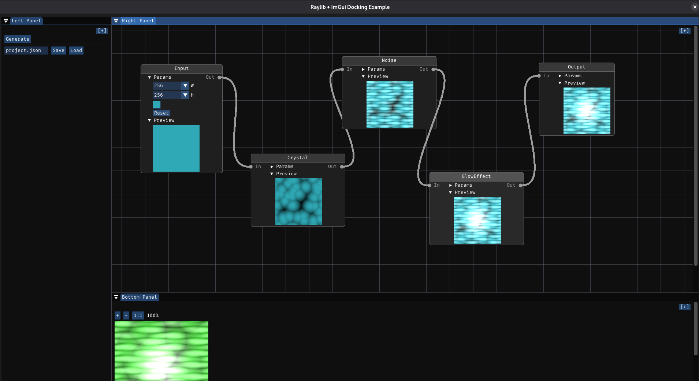

# TEXGEN

Node-based procedural texture generator for Linux. Connect generator and filter nodes in a visual graph to create tileable textures, noise patterns, and materials — all in real time.

Built with C++20, raylib, and Dear ImGui.

## Screenshot

<p align="center">
  
</p>

## Features

**Generators**
- Input (solid color), Noise (Perlin), Cells (Voronoi), Crystal, Bricks
- Perlin Noise RG2, Directional Gradient, Glow Effect, Wavelet

**Filters**
- Blur, Blur Kernel, Color Matrix, Coord Matrix
- Color Remap, Coord Remap, Derive, Ternary
- Paste, Bump, Linear Combine, Glow Rect
- HSCB (Hue/Saturation/Contrast/Brightness), Color Balance

**Workflow**
- Visual node editor with drag-and-drop connections
- Real-time preview on each node
- Save/load projects as JSON
- Export textures to TGA

Texture generation core based on [gentexture](https://github.com/farbrausch/fr_public) by Fabian Giesen (public domain).

## Requirements

- Linux
- g++ (C++20)
- cmake
- ninja
- git

## Build and Run

```bash
./run.bash
```

Clones all dependencies, builds raylib, builds the project, and runs it.

## Clean

```bash
./clean.bash        # remove everything (deps + build)
./clean.bash build  # remove build products only
```

## Libraries

All libraries are cloned automatically by `run.bash`:

| Library | Fork | Upstream |
|---------|------|----------|
| fmt | [gwerners/fmt](https://github.com/gwerners/fmt) | [fmtlib/fmt](https://github.com/fmtlib/fmt) |
| stb | [gwerners/stb](https://github.com/gwerners/stb) | [nothings/stb](https://github.com/nothings/stb) |
| imgui (docking) | [gwerners/imgui](https://github.com/gwerners/imgui) | [ocornut/imgui](https://github.com/ocornut/imgui) |
| nlohmann/json | [gwerners/json](https://github.com/gwerners/json) | [nlohmann/json](https://github.com/nlohmann/json) |
| raylib | [gwerners/raylib](https://github.com/gwerners/raylib) | [raysan5/raylib](https://github.com/raysan5/raylib) |
| rlImGui | [gwerners/rlImGui](https://github.com/gwerners/rlImGui) | [raylib-extras/rlImGui](https://github.com/raylib-extras/rlImGui) |
| ImNodes | [gwerners/ImNodes](https://github.com/gwerners/ImNodes) | [rokups/ImNodes](https://github.com/rokups/ImNodes) |

## Project Structure

```
CMakeLists.txt          root cmake
run.bash                build and run script
clean.bash              cleanup script
images/                 screenshots
res/                    fonts (FiraCode)
work/                   source code
  main.cpp              entry point
  Core.cpp/h            application core, config, window
  Ide.cpp/h             imgui IDE layout, docking panels
  Nodes.cpp/h           node graph logic
  AllNodes.cpp/h        all node type definitions
  TextureNode.h         base class for texture nodes
  Generator.h           generator interface
  ProjectIO.cpp/h       project save/load (JSON)
  Utils.cpp/h           file utilities
  Gradient.cpp/h        gradient utilities
  Voronoi.cpp/h         voronoi diagram generation
  extra_generators.*    custom texture generators
  ktg/                  gentexture library (Fabian Giesen)
cmake/                  cmake helper modules
```
